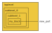
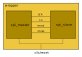

<!--- This file is part of ariadne. -->
<!---  -->
<!--- ariadne is free software: you can redistribute it and/or modify it under -->
<!--- the terms of the GNU General Public License as published by the Free Software -->
<!--- Foundation, either version 3 of the License, or (at your option) any later -->
<!--- version. -->
<!---  -->
<!--- ariadne is distributed in the hope that it will be useful, but WITHOUT ANY -->
<!--- WARRANTY; without even the implied warranty of MERCHANTABILITY or FITNESS FOR A -->
<!--- PARTICULAR PURPOSE. See the GNU General Public License for more details. -->
<!---  -->
<!--- You should have received a copy of the GNU General Public License along with -->
<!--- ariadne. If not, see <https://www.gnu.org/licenses/>. -->

# Ariadne

This tool helps you create structural RTL hierarchy levels

[Etymology](https://en.wikipedia.org/wiki/Ariadne)

While writing RTL, you can often divide your design in two parts. One is the
core functionality which you want to focus on. The other part is the structural
connection between all these blocks. Ariadne helps you automate the second part

All creations of extra wrapper levels, connections between modules, propagation
of extra signals, ... these can now be handled by Ariadne. It makes the design
phase less error-prone, cleans up your code and lets you focus on the relevant
parts

For example, lets take the following view of our current architecture



This example can be found at [test/vhdl_tests/vhdl_port_propagation](test/vhdl_tests/vhdl_port_propagation)

You have a block called my_block.vhd several hierarchy levels deep in your
design. During your project you realise that one of its output ports needs to be
propagated to the toplevel. Normally you would need to manually change all
intermediate files. This is time consuming and error-prone. If instead we made
all these structural RTL levels with Ariadne, the propagation can be done
automatically

Another common example would be when you want to connect two modules. Most of
the corresponding ports will only differ by the port direction or a simple
pattern. Ariadne can help you to make all these connection with only a few lines
of code



This example can be found at [test/vhdl_tests/vhdl_spi](test/vhdl_tests/vhdl_spi)

Supported languages:

* VHDL
* Verilog
* SystemC

Not supported:

* SystemVerilog

## Documentation

The full documentation can be found [here](doc/ariadne.adoc)

It's written in [Asciidoc](https://docs.asciidoctor.org/asciidoc/latest/).

You can process it with [Asciidoctor](https://asciidoctor.org/) to a different
output format like HTML, PDF, ...

Using the
[Asciidoctor.js](https://github.com/asciidoctor/asciidoctor-browser-extension)
browser extension, you can render the documentation on the fly

Firefox prevents the extension from including other files. If you see this
rendering issue with the documentation, you can do the following steps to
circumvent it:

* Open the Firefox configuration with the URL about:config
* Find the parameter security.fileuri.strict_origin_policy
* Set the value of this parameter to false

## Installation

**Warning**
We do not support Ruby version 2.7.x

**Warning**
We use Git submodules so don't forget to run the following command before
compiling
```bash
git submodule update --init
```

### Compilation

Compilation is done with [CMake](https://cmake.org/)

Generate the project build system:

```bash
cmake -B build -S ./ -D SCRIPT_RUBY=ON -D SCRIPT_PYTHON=ON
```

You must define either to build for RUBY script support, Python script support
or both

By default the build system will use Makefiles.
To use Ninja files you can run the following command:

```bash
cmake -B build -S ./ -G Ninja -D SCRIPT_RUBY=ON -D SCRIPT_PYTHON=ON
```

Build the project:

```bash
cmake --build build
```

To specify the maximum number of concurrent processes when building, you can use
the following option:

```bash
cmake --build build -j 4
```

### Packages

For Ubuntu and Debian the following packages are required:

* cmake
* For Ninja builds: build-essential
* python3-dev
* ruby-dev
* flex
* bison
* asciidoctor (for documentation)

## Tests and regressions

A regression testbench can be found at [](test). Here we have a collection of
tests subdivided into different categories

The tests are integrated in the CMake flow with
[CTest](https://cmake.org/cmake/help/book/mastering-cmake/chapter/Testing%20With%20CMake%20and%20CTest.html)

A short summary of how to work with CTest can be found
[here](https://coderefinery.github.io/cmake-workshop/testing)

### Running tests

To run all the tests you must first compile everything and then run the
following command:

```bash
ctest --test-dir build
```

If you want to display the output of a test when it fails, you can add the
following flag:

```bash
ctest --test-dir build --output-on-failure
```

To specify the maximum number of concurrent processes when running the tests,
you can use the following option:

```bash
ctest --test-dir build -j 4
```

All the tests are subdivied into different categories. The test names are
prefixed with the category. This lets you filter for certain tests. For example,
the next command will run all tests that contain the string "vhdl_"

```bash
ctest --test-dir build -R vhdl_
```

All tests are accompanied with a label. These are used to subdivide the tests in
certain groups. For example, the next command will run all tests where the label
contains the string "vhdl"

```bash
ctest --test-dir build -L vhdl
```

## License

Ariadne is distributed under the
[GNU General Public License v3.0](https://www.gnu.org/licenses/gpl-3.0.html)

## Contact info

Created by [easics](https://www.easics.com/)

Tool specific questions: tools@easics.be
